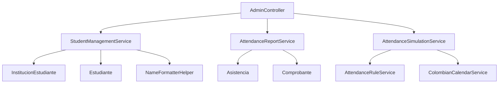
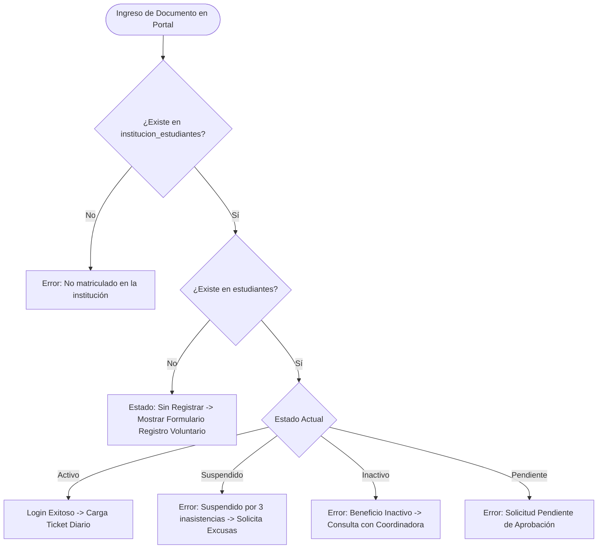

# 🏛️ DESIGN PLAN: Arquitectura Tecnológica y Modularización del Sistema

> **Proyecto:** Sistema de Beneficio Alimentario - I.E. Enrique Vélez Escobar  
> **Fecha:** 2026-07-30  

---

## 🏗️ 1. Rediseño y Modularización del Backend (`App\Modules\Admin`)

Para resolver el problema del monolito `AdminService.php` y garantizar la separación de responsabilidades, dividiremos las funciones del dominio Administrativo en 3 sub-servicios especializados:



### 🔨 Sub-Servicios a Crear:

1. **`StudentManagementService.php`**:
   - `getStudents()`: Lista general de beneficiarios.
   - `createSingleStudent(array $data)`: Alta individual en `institucion_estudiantes`.
   - `importBulkStudents(array $data)`: Importación masiva escolar.
   - `updateStudent(array $data)`: Edición segura y transaccional (Doc, Nombre, Grupo) con actualización en cascada.
   - `toggleCupo(string $documento)`: Cambia el estado a `Inactivo` (o elimina si era 'Pendiente') preservando el historial.
   - `cambiarEstadoBeneficio(string $documento, string $nuevoEstado)`: Transiciones de estado seguras.
   - `activateStudentManually(string $documento)`: Activación directa.
   - `deleteInstitutionalStudent(string $documento)`: Borrado seguro con transacciones.

2. **`AttendanceReportService.php`**:
   - `getDailyReport(string $fecha)`: Reporte de asistencia diaria.
   - `getWeeklyReport()`: Reporte acumulado de 7 días.
   - `getGroupedCourses()`: Agrupación visual por cursos y grupos con conteo de matriculados vs inscritos.

3. **`AttendanceSimulationService.php`**:
   - `simulateDay(string $fecha, array $asistentes)`: Ejecución de simulaciones de asistencia y reglas de suspensión.

---

## 🔒 2. Estrategia de Transacciones en Cascada de Documento

Cuando la Coordinadora actualice un número de documento (`docOriginal` -> `docNuevo`), se ejecutará un procedimiento transaccional en `StudentManagementService::updateStudent()`:

```php
DB::transaction(function () use ($docOriginal, $docNuevo, $nombreCompleto, $grupo) {
    // 1. Deshabilitar temporalmente llaves foráneas si aplica o actualizar en orden inverso
    // 2. Actualizar o Re-vincular en institucion_estudiantes
    // 3. Actualizar en estudiantes
    // 4. Actualizar asistencias past
    DB::table('asistencias')->where('documento', $docOriginal)->update(['documento' => $docNuevo]);
    // 5. Actualizar comprobantes past
    DB::table('comprobantes')->where('documento', $docOriginal)->update(['documento' => $docNuevo]);
    // 6. Actualizar justificaciones past
    DB::table('justificaciones')->where('documento', $docOriginal)->update(['documento' => $docNuevo]);
});
```

---

## 🔀 3. Matriz de Validación de Acceso en Portal Estudiante (`StudentService::validateStudent`)



---

## 🛠️ 4. Formateador Unificado de Nombres (`NameFormatterHelper`)

Creación de un helper o método auxiliar en `StudentManagementService`:
- Preserva nombres y apellidos compuestos sin recortarlos al convertir a `nombre_completo` o al extraer `nombres` y `apellidos`.
