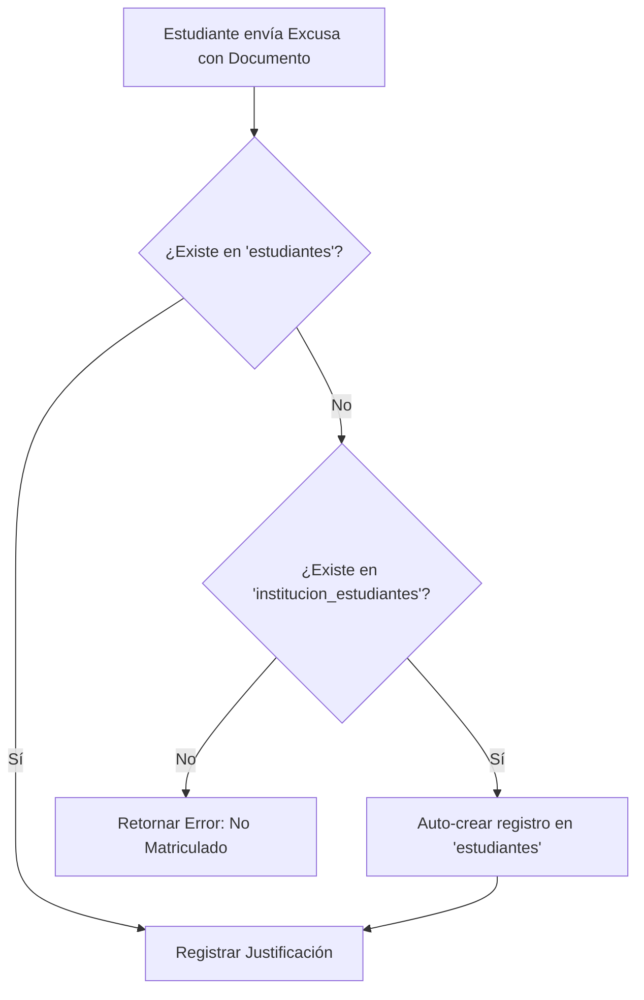

# 🏗️ DESIGN PLAN: Solución de Justificación por Documento y Aislamiento de Formularios

## 🏛️ Cambios de Arquitectura

---

## 🛠️ Plan de Modificaciones

### 1. `backend/app/Modules/Admin/Services/JustificationService.php`
- Modificar `submitJustification`:
  - Buscar en `Estudiante::find($documento)`.
  - Si es `null`, buscar en `InstitucionEstudiante::find($documento)`.
  - Si se encuentra en `InstitucionEstudiante`:
    - Extraer nombres y apellidos mediante desglose seguro de `nombre_completo`.
    - Crear `Estudiante::create(['documento' => $documento, 'nombres' => $nombres, 'apellidos' => $apellidos, 'grupo' => $institucion->grupo, 'estado' => 'Activo'])`.
  - Continuar con el guardado de la `Justificacion`.

### 2. `frontend-estudiante/src/components/justificaciones/GestionTab.vue`
- Unificar y refactorizar el componente `GestionTab.vue`:
  - Envolver "Justificar Inasistencia" en `<form @submit.prevent="submitJustification">`.
  - Envolver "Renuncia Voluntaria" en `<form @submit.prevent="confirmRenounce">`.
  - Asignar `type="submit"` a los botones principales de envío de cada formulario.
  - Asegurar que la apertura del modal de renuncia (`showRenounceModal`) no interfiera ni se ejecute al enviar la justificación.

### 3. `frontend-estudiante/src/components/GestionTab.vue`
- Sincronizar o consolidar ambos archivos de componentes para que `PortalView.vue` y `PortalPage.vue` utilicen el componente actualizado y probado.
