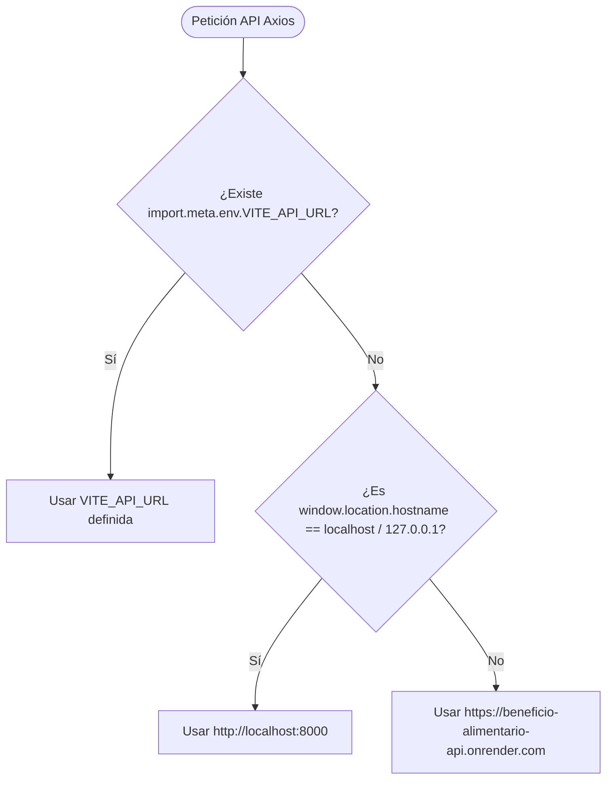

# ⚙️ SPEC: Detección Dinámica de URL de API en Producción

> **Proyecto:** Sistema de Beneficio Alimentario - I.E. Enrique Vélez Escobar  
> **Fecha:** 2026-07-30  
> **Estado:** Aprobado para Ejecución  

---

## 🎯 1. Objetivo
Garantizar que en producción (Render o cualquier servidor de hosting remoto), el cliente API de los frontends se conecte automáticamente a `https://beneficio-alimentario-api.onrender.com` sin tomar por defecto `http://localhost:8000`.

---

## 🔍 2. Diagnóstico del Problema de Entorno

| Causa Identificada | Mecanismo de Falla | Solución Aplicada |
|---|---|---|
| **Sustitución en Build de Vite** | Durante `npm run build` en Render, si la variable `VITE_API_URL` no está definida en un `.env.production`, Vite la reemplaza por `undefined`. | Crear `.env.production` en `frontend-estudiante` y `frontend-coordinadora` especificando la URL de Render. |
| **Fallback Estático a `localhost`** | `client.js` usaba `import.meta.env?.VITE_API_URL || 'http://localhost:8000'`, lo que provocaba que fuera del entorno local intentara conectarse a `localhost:8000`. | Implementar resolución inteligente: Si `hostname !== 'localhost'` y `hostname !== '127.0.0.1'`, usar automáticamente la URL de producción de Render. |

---

## 📋 3. Reglas de Resolución de URL de API (`client.js`)

